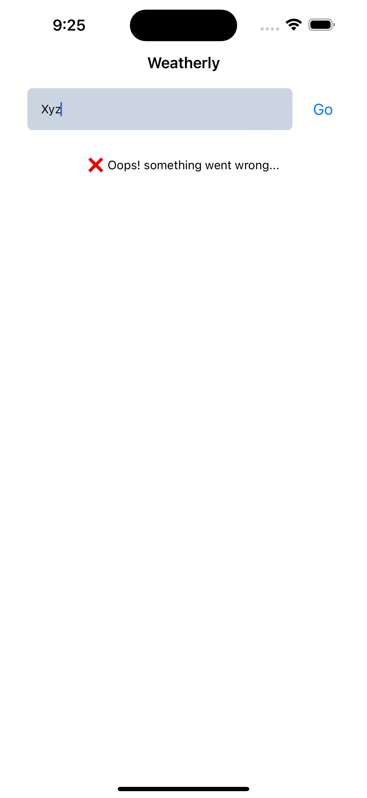

# Weather App ☀️🌧️

This Weather App is built using **React Native** and fetches real-time weather data from an external API. The app allows users to search for a city and displays the current temperature in Celsius.

---

## Features ✨
- Search for any city to get current weather information.
- Displays temperature in Celsius.
- Responsive design suitable for both Android and iOS devices.

---

## Screenshots 📸

### 1. Main Screen (Weather Information)


### 2. Loading Screen


---

## How to Run 🏃‍♂️

1. Clone the repository:
    ```bash
    git clone https://github.com/anirudhsingh8/WeatherApp.git
    ```

2. Navigate to the project directory:
    ```bash
    cd WeatherApp
    ```

3. Install dependencies:
    ```bash
    npm install
    ```

4. Run the app on an Android or iOS simulator:
    ```bash
    npm start
    ```

---

## Concepts Used 💡
- **API Calls**: Utilized `fetch` to get weather data from an external API.
- **State Management**: Managed search input, weather data, and loading states using `useState`.
- **Conditional Rendering**: Displayed loading indicators and error messages based on API response.
- **Responsive Design**: Ensured the UI adapts to different screen sizes.